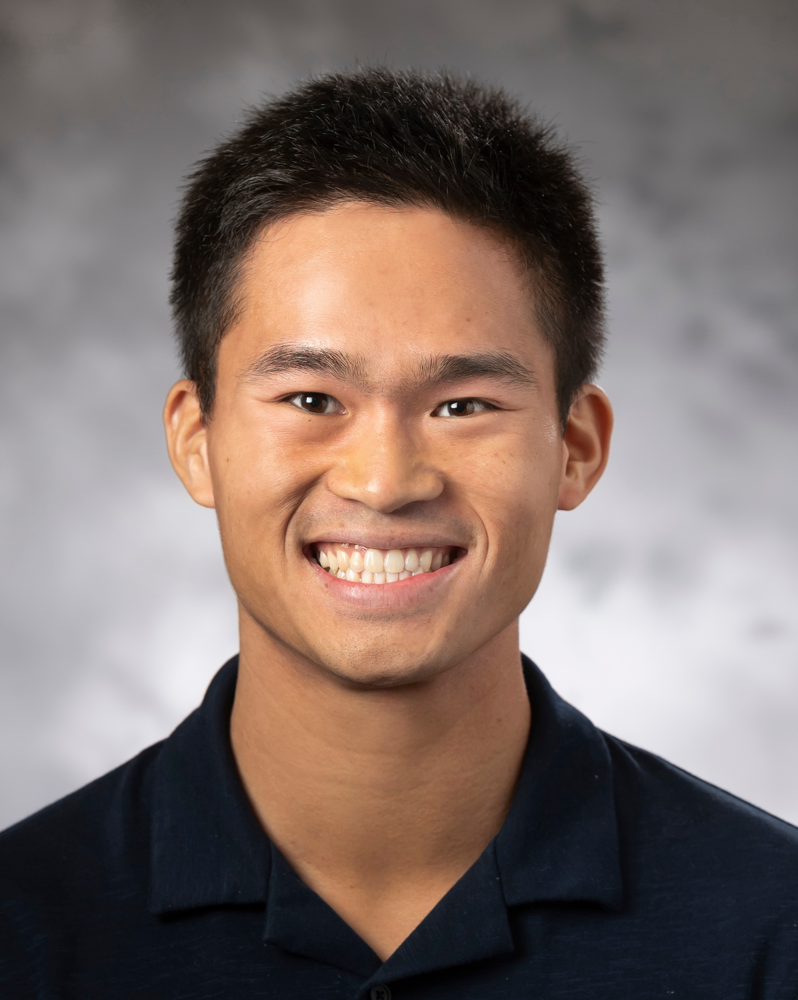
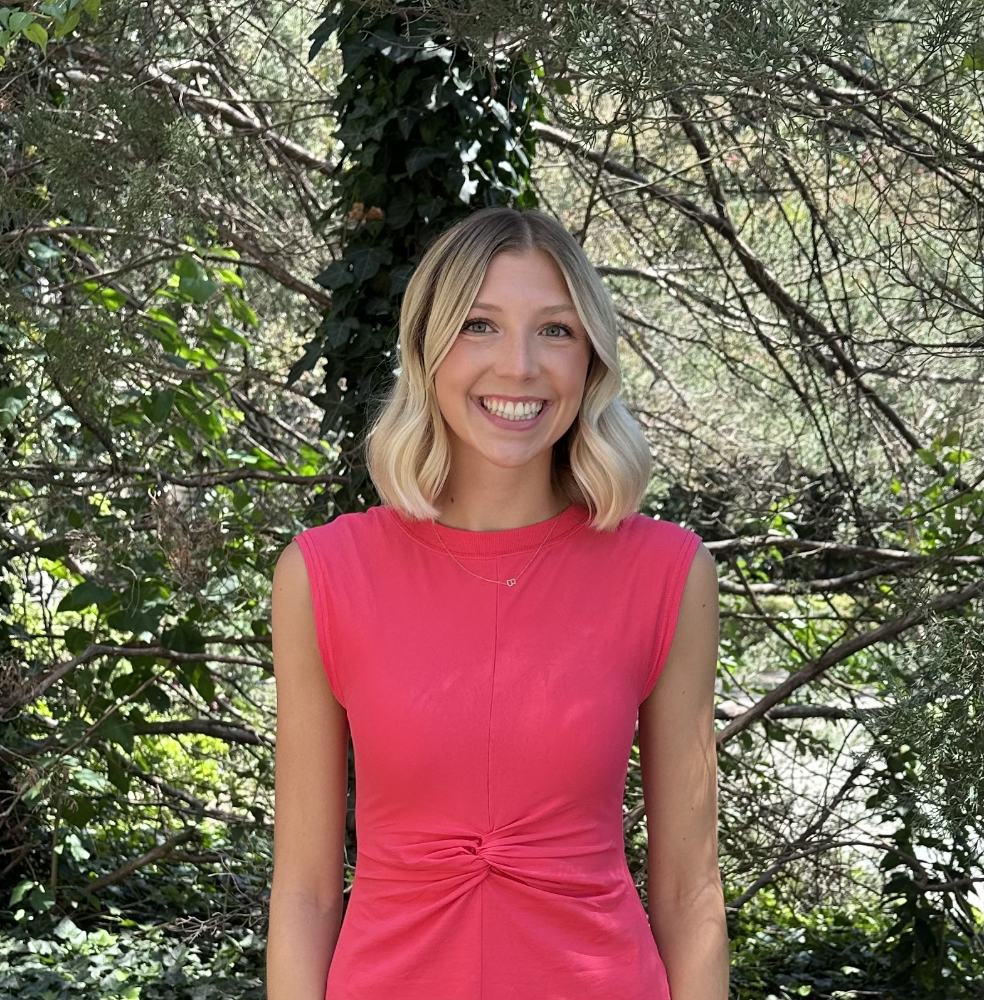

## Instructor

{style="float:right; padding: 0 0 0 10px; width:150px; height:150px; border-radius: 50%; object-fit: cover;" fig-alt="Headshot of Josh Lim"}

Josh Lim is a second year Ph.D. student in the Department of Statistical Science at Duke University Josh's research explores causal inference, missing data, machine learning, and their applications to biomedical and clinical medicine research.
Outside of academics, you may find Josh competing with Duke Men's Club Volleyball, performing with Duke Chinese Dance, or flipping with Duke Gymnastics.

You can contact him at [josh.lim\@duke.edu](mailto:josh.lim@duke.edu)) with any questions regarding this course.

*Office hours: TBD in Old Chem 203*

## Lab Instructor & Course Coordinator

{style="float:right; width:150px; height:150px; border-radius: 50%; object-fit: cover;" fig-alt="Headshot of Dr. Mary Knox"}

Dr. Mary Knox (she/her) is the course coordinator for this course.\

You can contact her (at [mary.knox\@duke.edu](mailto:mary.knox@duke.edu)) with any questions regarding accommodations, missed work, extensions, registration, etc.

*Office hours: TBD*

## Teaching Assistant

{style="float:right; width:150px; height:150px; border-radius: 50%; object-fit: cover;" fig-alt="Headshot of Katie Solarz"}

is the teaching assistant for this course.\

*Office hours: Wednesdays, 5:30 - 7:30pm in Old Chem 203B*
